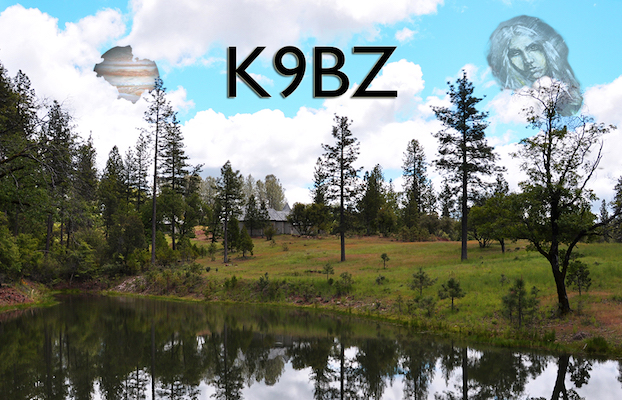

	
  		<b>K9BZ</b>  
  	
  	
  		<b>"The Busy Dog"</b>  
  	
  	<body text-align:center; leftmargin="100px"; rightmargin="100px">
	

# Bio
First licensed as *WA2KNE* as novice around 1977. The oldest callbook that has this callsign is Winter 1978. For the code test, I had to get at least 25 letters in a row and I'm pretty sure I got the 26th wrong.  Anyway, I let it expire before I could get on the air and started again in 1986 as *KB6NWE*, became a general in 1987 as *N6OJU*, and shortly after that, barely passed the code test to become advanced. In 2011, with code requirement safely removed I upgraded to extra and took the vanity call **K9BZ**, because it reminds me of what I feel like sometimes like _The Busy Dog_. Also all the California (6) 1x2s were taken

Like lots of us, I keep falling out of the hobby, but watching some recent youtube videos got me interested again. I re-learned morse code and then found FT8 and FT8Call and since then have been addicted to digital.

## Current Addiction
FT8 (about 475 logged contacts) and FT8Call (about 2 logged contacts)

## Equipment

### Rig
Yaesu FT-857D, housed in a [Commander 857](https://www.portableuniversalpower.com/commander-857/) ammo can battery back and control center and paired with an LDG YT-100 automatic tuner

### CW Keyer
[Begali Pearl](https://www.i2rtf.com/pearl.html) with the Palladium finish and turtle base. Way more keyer than I'll ever need

### Antenna
Alpha-Delta DX-CC *"hanging from a free since 2011"*

## Portable Equipment

### Antennas
* Chameleon CHA MPAS
* HFEDZ